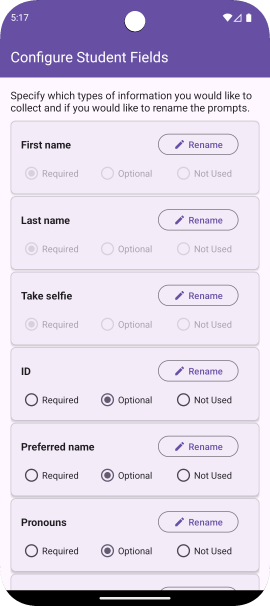
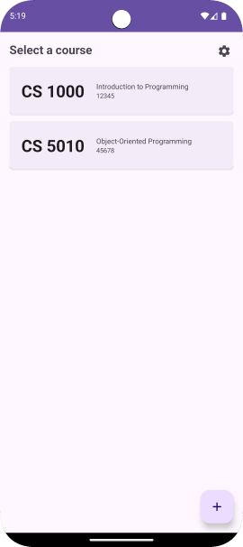
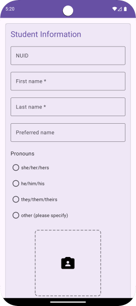
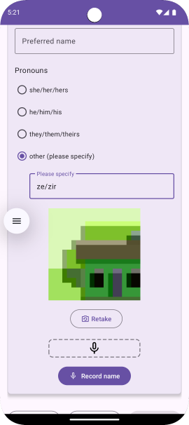
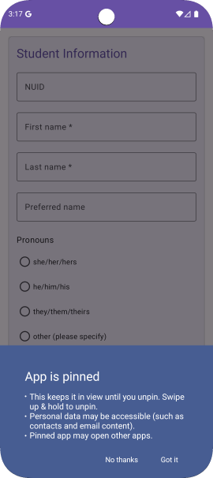

# Roster Capture

Roster Capture is an Android app that helps teachers connect with their students by learning
their names, faces, and how to address them. Teachers specify what information to collect
(photos, preferred names, pronouns, audio pronunciations), and then pass the device around 
their classroom, letting students take selfies and add their information.

The collected information is passed to the popular free flashcard app,
[AnkiDroid](https://play.google.com/store/apps/details?id=com.ichi2.anki), where teachers can
study the information and quiz themselves. They can also sync the data from AnkiDroid to
to [AnkiWeb](https://ankiweb.net/about), so it can be accessed online or through Anki's
desktop or iOS apps.

## Installation

To install Roster Capture, go to [Latest Releases](https://github.com/espertus/roster-capture/releases/latest)
on your Android device (or use this [QR code](images/rc-release-400.png)) and click
on the link ending in "apk", such as `rostercapture-v0.1.0-release.apk`

This [one-minute video](images/installation-screencast.mp4)
([silent version](images/install-screencast.webm)) shows all the installation steps.

## FAQ
### What information can I collect from students?

These are the required fields:
* First name
* Last name
* Selfie

The teacher can decide whether to collect the following types of information and whether
they should be required or optional:
* ID
* Preferred name
* Audio recording of student's name
* Pronouns
   * She/her/hers
   * He/him/his
   * They/them/theirs
   * Other (specified by user)

The prompt for any field can be changed. For example, I use "NUID" [Northeastern ID]
for ID information for my students.

### Is it safe to give students my phone?

When you open the Add Student screen, you are prompted to enable [Android
pinning](https://support.google.com/android/answer/9455138?hl=en)
so students can't do anything else with your phone. If pinning is engaged,
it will show up on your display:

Students may be able to view incoming notifications. You can protect yourself by:
* [Disabling lock screen notifications](https://support.google.com/android/answer/9079661)
* [Enabling Do Not Disturb mode](https://support.google.com/android/answer/9069335)

For more security, use a burner phone or [Guest Mode](https://support.google.com/pixelphone/answer/6115141).

### What permissions are required?

* CAMERA, so students can take selfies
* INTERNET, so it can check for updates
* RECORD_AUDIO, so students can record their names
* USE_BIOMETRIC, so students can't do anything but add their information

### What version of Android is required?

Android 14 (API 34)

### What information does the app collect?

All information about your classes and students stays on your phone.
The app does report crash data and analytics, such as that the user
created their first class (but not any information about the class)
[[view code](https://github.com/search?q=repo%3Aespertus%2Froster-capture+Analytics.log&type=code)].

### What if I have questions or suggestions?

[Create an issue](https://github.com/espertus/roster-capture/issues/new),
or email me ([rc@ellenspertus.com](mailto:rc@ellenspertus.com)).
I'd be happy to hear from you.

## Credits

I got the idea of passing a phone around the classroom to get selfies from
[Name That Student](http://www.alexandramarin.ca/namethatstudent.html)
by [Alexandra Marin](http://www.alexandramarin.ca/).

This app uses AnkiDroid's
[Instant-Add API](https://github.com/ankidroid/Anki-Android/wiki/AnkiDroid-API).

### Image sources
The app icons were created by Aisha Asgha.

* [Pictogrammers](https://pictogrammers.com/) ([Apache License 2.0](https://www.apache.org/licenses/LICENSE-2.0))
  * camera_account.xml
  * camera_retake_outline.xml
  * lock.xml
  * microphone_outline.xml
  * stop_circle_outline.xml
* Material Design icons by Google ([Apache License 2.0](https://www.apache.org/licenses/LICENSE-2.0))
  * ic_add_24.xml
  * ic_edit_24.xml
  * is_settings_24.xml
  * outline_app_blocking_24.xml
  * outline_error_24.xml
* Claude.ai
  * dashed_border.xml
  * solid_border.xml
